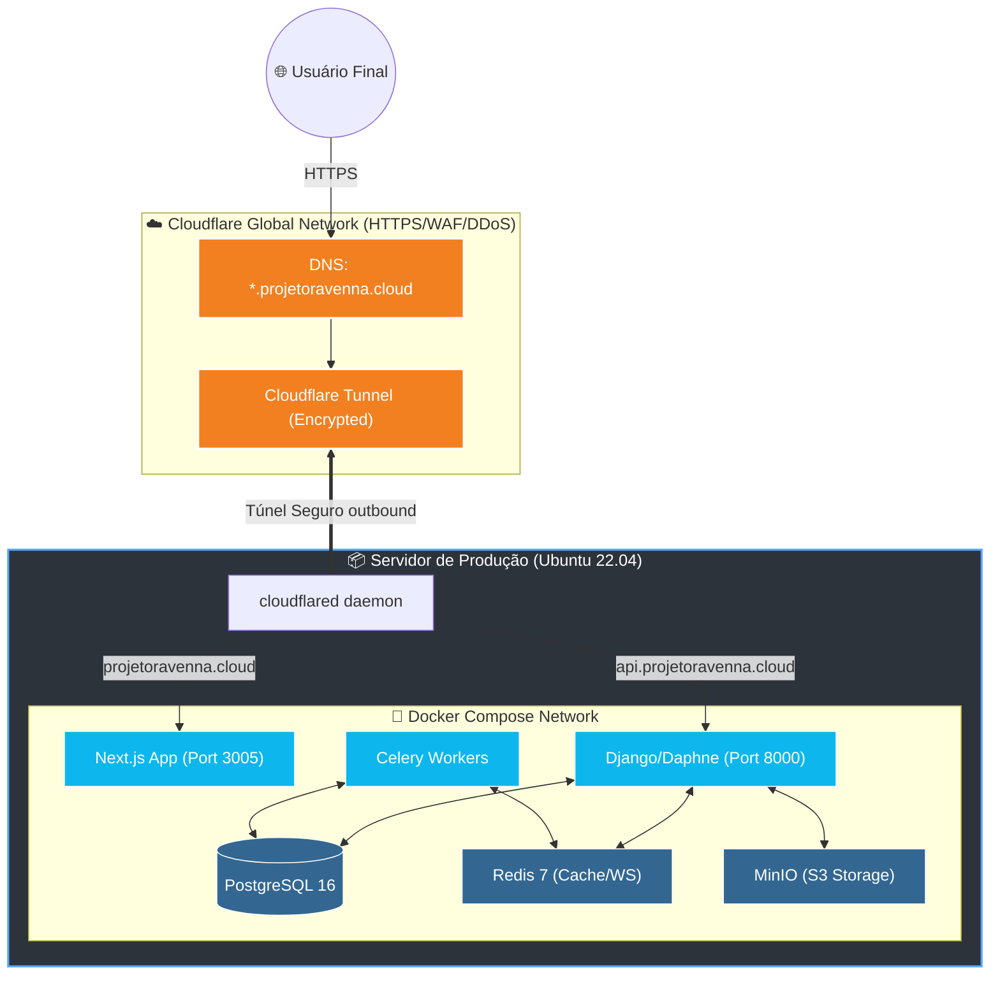

# 🦴 Backbone: A Espinha Dorsal do seu SaaS Multi-Tenant

> **Uma plataforma White-Label de nível empresarial, robusta e escalável, projetada para conectar empresas, pessoas e conteúdos.**

---

## 💎 Apresentação do Ecossistema

O **Backbone** não é apenas um software; é uma infraestrutura completa de **Software as a Service (SaaS)**. Ele permite que você gerencie múltiplas empresas (Tenants) em uma única instância, oferecendo isolamento total de dados, personalização de marca e controle granular de funcionalidades.

### 🌟 Diferenciais que encantam:
*   🏢 **Arquitetura Multi-Tenant Pura**: Isolamento lógico via `company_id` com performance otimizada.
*   🛡️ **Segurança de Elite**: Proteção contra DDoS e WAF via Cloudflare, com acesso via Túneis Criptografados.
*   🎨 **White-Label Total**: Cores, logos e temas personalizados por empresa em tempo real.
*   💬 **Comunicação Ativa**: Chat em tempo real (WebSockets) e notificações Push integradas.
*   ⚡ **Performance Extrema**: Backend em Django 5.0 com processamento assíncrono (Celery) e Frontend em Next.js 15.

---

## 🎨 Fluxograma Arquitetural — Cloudflare Edge

Este diagrama ilustra a jornada de um dado, desde a borda do Cloudflare até o coração dos nossos containers no seu servidor Ubuntu.



---

## 🚀 Passo a Passo: Do Código ao Deploy Real

Siga este roteiro direto para colocar o **Backbone** no ar em minutos.

### 1️⃣ Preparação do Porto (No Servidor)
Garanta que seu servidor Ubuntu tenha o Docker instalado e as portas 80/443 fechadas (segurança total!). O acesso será pelo túnel.

```bash
# Atualize e instale o Docker
sudo apt update && sudo apt install -y docker.io docker-compose-v2
```

### 2️⃣ O Coração do Ambiente (.env.prod)
Copie o exemplo e defina suas chaves secretas. Este arquivo é a alma da segurança do seu sistema.

```bash
cp .env.prod.example .env.prod
nano .env.prod
# Defina: 
#   ALLOWED_HOSTS=api.projetoravenna.cloud,projetoravenna.cloud
#   NEXT_PUBLIC_API_URL=https://api.projetoravenna.cloud
```

### 3️⃣ O Comando de Elite (Deploy)
Execute o script de automação que preparamos. Ele fará todo o trabalho pesado por você.

```bash
chmod +x scripts/deploy.sh
# Primeiro deploy (pula o backup já que o banco está vazio)
SKIP_BACKUP=1 ./scripts/deploy.sh
```

### 4️⃣ Ativação do Túnel Cloudflare
No painel da Cloudflare (Zero Trust), aponte os hostnames para as portas locais:
*   `projetoravenna.cloud` ➡️ `http://localhost:3005`
*   `api.projetoravenna.cloud` ➡️ `http://localhost:8005` (A porta 8005 do host mapeia para 8000 do container).

---

## 🛠️ Stack Tecnológica

| Camada | Tecnologia | Papel Principal |
| :--- | :--- | :--- |
| **Frontend** | `Next.js 15` | UX fluida, SSR e SEO amigável. |
| **Backend** | `Django 5.0` | Lógica de negócios e Multi-tenancy. |
| **Real-time** | `Daphne/Channels` | Mensageria WebSocket instantânea. |
| **Database** | `PostgreSQL 16` | Persistência de dados robusta e relacional. |
| **Cache** | `Redis 7` | Velocidade em cache e broker para Celery. |
| **Storage** | `MinIO` | Uploads compatíveis com padrão S3. |
| **Gateway**| `Cloudflare` | Segurança máxima e tunnelamento Zero Trust. |

---

### 📬 Contato e Suporte
Desenvolvido com excelência técnica para ser a fundação do seu próximo grande SaaS.

**Backbone — A estrutura que suporta o seu crescimento.**
