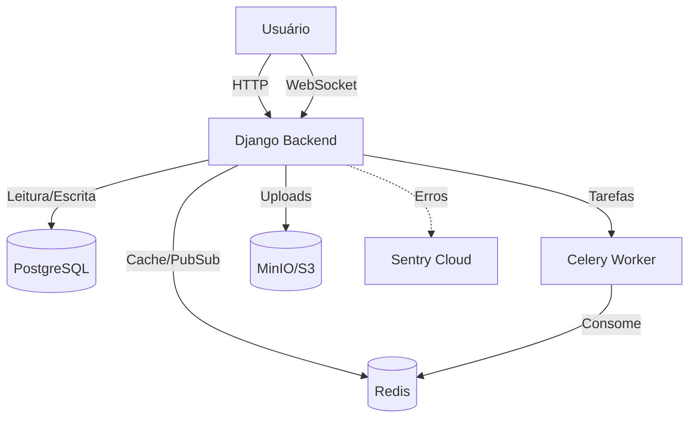

# Stack Tecnológico e Ferramentas

Este documento detalha as principais ferramentas utilizadas no backend do projeto Backbone, explicando sua função geral e como são aplicadas especificamente no nosso sistema.

## 1. Celery

### O que é?
O **Celery** é uma fila de tarefas assíncronas baseada em mensagens distribuídas. Ele permite executar tarefas pesadas ou demoradas em segundo plano, fora do ciclo de requisição/resposta HTTP, garantindo que o servidor web continue rápido e responsivo.

### Como usamos?
No Backbone, o Celery é usado para:
- **Envio de Emails**: Como o email de boas-vindas (`send_welcome_email`), para não travar o cadastro do usuário.
- **Processamento em Background**: Futuras tarefas como geração de relatórios, processamento de imagens ou integrações lentas.

**Configuração**:
- Arquivo: `config/celery.py`
- Broker (Transporte): Redis (`redis://localhost:6379/0`)
- Definição de Tarefas: Decorator `@shared_task` em `apps/*/tasks.py`.

## 2. Sentry

### O que é?
O **Sentry** é uma plataforma de monitoramento de erros em tempo real. Ele captura exceções (crashes) e problemas de performance, fornecendo stack traces detalhados e contexto (usuário, URL, dados da requisição).

### Como usamos?
- **Monitoramento de Produção**: Captura erros não tratados no Django e Celery.
- **Integração**: Configuramos o `sentry_sdk` em `config/settings.py`.
- **Contexto**: Se ativado (`send_default_pii=True`), ele associa o erro ao usuário logado, facilitando o suporte.

## 3. Redis

### O que é?
O **Redis** é um armazenamento de estrutura de dados em memória (in-memory data store), usado como banco de dados, cache e message broker. É extremamente rápido.

### Como usamos?
No Backbone, o Redis é a peça central de performance e assincronismo:
1.  **Broker do Celery**: Armazena a fila de tarefas a serem processadas.
2.  **Channel Layer (WebSockets)**: Permite que diferentes instâncias do Django comuniquem mensagens WebSocket (ex: chat, status online).
3.  **Cache**: Armazena dados de acesso frequente (ex: status online de usuários via `PresenceConsumer`).
    - *Nota*: Usamos `make_key_with_tenant` para garantir que o cache seja isolado por empresa (Tenant).

## 4. Ruff

### O que é?
O **Ruff** é um linter e formatador de código Python extremamente rápido, escrito em Rust. Ele substitui ferramentas como Flake8, Black e isort.

### Como usamos?
- **Qualidade de Código**: Garante que o código siga os padrões PEP8 e boas práticas.
- **Pre-commit**: Pode ser configurado para rodar antes de cada commit para impedir código "sujo".
- **Comando**: `ruff check .` (linter) e `ruff format .` (formatador).

## 5. Coverage

### O que é?
O **Coverage.py** é uma ferramenta para medir a cobertura de código dos testes. Ele mostra quais linhas do seu código foram executadas durante os testes e quais não foram.

### Como usamos?
- **Validação de Testes**: Garante que nossas regras de negócio (ex: validação de licença, isolamento de tenant) estão realmente sendo testadas.
- **Relatório**: Gera relatórios HTML/XML para visualizar "buracos" nos testes.
- **Comando**: `coverage run manage.py test` e `coverage html`.

## 6. MinIO (S3 Compatible Storage)

### O que é?
O **MinIO** é um servidor de armazenamento de objetos de alta performance, compatível com a API do Amazon S3. Ele permite armazenar arquivos (imagens, documentos) de forma escalável, como se fosse na nuvem AWS, mas localmente ou em servidor próprio.

### Como usamos?
- **Media Files**: Armazenamento de uploads de usuários (avatares, anexos de chat, imagens de artigos).
- **Configuração**: Em `settings.py`, se `USE_S3=True`, usamos `django-storages` com `boto3` para conectar ao MinIO/S3.
- **Benefício**: Separa o armazenamento de arquivos do servidor de aplicação (Stateless), facilitando o deploy em containers (Docker).

---

## Resumo da Arquitetura

